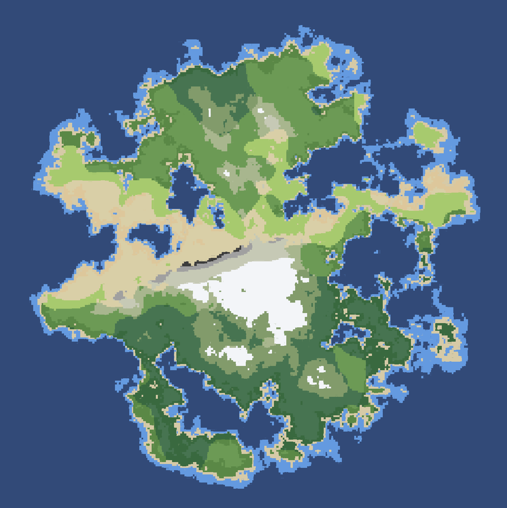

  <h1>Pixel Island Generator</h1>
  
A pixel-style random island (or terrain) generator. 🏝️

## Intro

Using Perlin noise and FBM to generate elevation and moisture, and assigning biomes accordingly.
Also, you can generate different types of islands by adjusting the parameters.

Powered by WebGL, It's fast!

## Preview

 [pixel-island-generator.netlify.app](https://pixel-island-generator.netlify.app)

## Tech Stack

* Three.js
* Vite
* TypeScript
* GLSL
* Tweakpane
